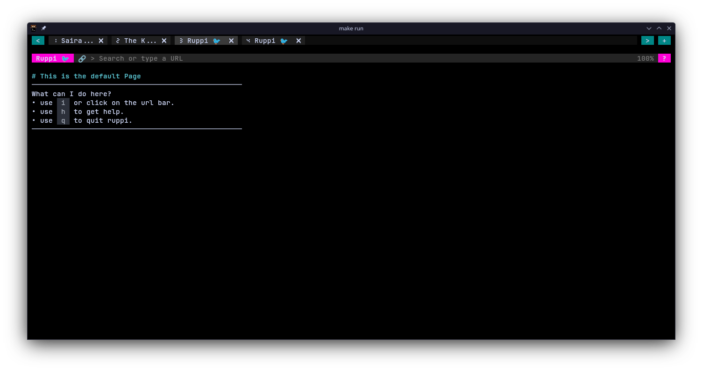

# Rupi 🐦
A wip simple terminal Web browser written in golang!

TODO:
- Basic HTML parser
- Basic CSS parser
- Basic DOM Rendering Using Bubble Tea.
- Different font size in kitty terminal. [Info](https://sw.kovidgoyal.net/kitty/text-sizing-protocol/)

## Demo
__Kitty Terminal__
